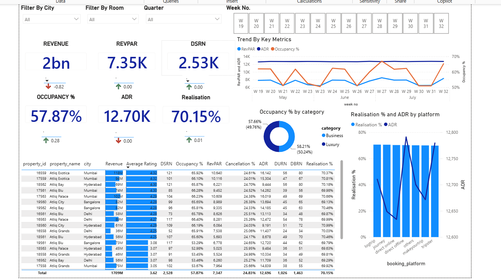

# Hotel Booking Analysis Dashboard | Power BI

## Project Overview

This project presents an interactive **Hotel Booking Analysis Dashboard** built in **Power BI** to analyze booking performance, occupancy trends, cancellation behavior, and revenue-related metrics across hotel categories and properties. The goal of the dashboard is to transform raw hotel booking data into actionable business insights that can help stakeholders monitor performance, identify problem areas, and make better operational decisions.

The dashboard focuses on key hospitality metrics such as **Occupancy %**, **Cancellation %**, **Average Daily Rate (ADR)**, **Revenue**, **Realisation %**, and booking trends across room categories and hotel segments. It is designed to provide a clear and interactive view of hotel performance using filters, KPIs, and category-wise comparisons.

---

## Objectives

* Analyze overall hotel booking performance using interactive Power BI dashboards
* Track key hospitality KPIs such as occupancy, cancellations, revenue, and ADR
* Compare room category performance across multiple hotel segments
* Identify booking and cancellation patterns affecting revenue and utilization
* Support business decision-making through visual and data-driven insights

---

## Tools & Technologies Used

* **Power BI** – dashboard development and data visualization
* **Power Query** – data cleaning and transformation
* **DAX** – KPI calculations and custom measures
* **Excel / CSV dataset** – source data used for analysis

---

## Key Metrics / KPIs Tracked

* **Total Revenue**
* **Total Bookings**
* **Occupancy %**
* **Cancellation %**
* **Average Daily Rate (ADR)**
* **Realisation %**
* **Category-wise performance**
* **Booking trends and status analysis**

---

## Dashboard Features

* Interactive filters and slicers for focused analysis
* KPI cards for high-level business performance monitoring
* Category-wise occupancy and booking analysis
* Cancellation trend analysis to identify booking loss patterns
* Revenue and ADR tracking across hotel segments
* Visual comparison of hotel performance metrics

---

## Business Problem

Hotels often deal with challenges such as fluctuating occupancy, booking cancellations, and uneven performance across room categories. Without a centralized reporting view, it becomes difficult to understand which areas are driving revenue, where cancellations are hurting performance, and which room categories are underperforming.

This dashboard was built to solve that problem by providing a single, interactive view of hotel booking performance and highlighting the most important operational and revenue trends.

---

## Dataset Information

The dataset used in this project contains hotel booking-related information such as:

* Booking ID
* Hotel / Property details
* Room category
* Booking status
* Revenue
* Occupancy-related data
* ADR / pricing-related fields
* Date / time-based booking information

> **Note:** Dataset files used in this project are included in the repository if publicly shareable. If not included, the project still provides dashboard screenshots and documentation of the analysis performed.

---

## Key Insights

Some of the insights that can be derived from the dashboard include:

* Identification of room categories with the highest and lowest occupancy rates
* Tracking of cancellation patterns and their impact on overall booking performance
* Comparison of revenue generation across hotel categories or properties
* Analysis of ADR and realization trends to evaluate pricing efficiency
* Understanding how different booking segments contribute to overall performance

---

## Repository Structure

```bash
hotel-booking-analysis-powerbi/
│
├── README.md
├── LICENSE
├── dashboard/
│   └── Hotel_Booking_Dashboard.pbix
├── data/
│   └── [dataset files]
├── screenshots/
│   ├── overview.png
│   ├── occupancy-analysis.png
│   ├── revenue-analysis.png
│   └── booking-trends.png
└── docs/
    └── insights.md
```

---

## Dashboard Preview

Add screenshots of your dashboard pages in the `screenshots/` folder and link them here.



---

## How to Use

1. Download the `.pbix` file from the `dashboard/` folder
2. Open it in **Power BI Desktop**
3. Refresh the dataset connection if required
4. Explore the dashboard pages and interact with filters/slicers

---

## Project Outcome

This project demonstrates how Power BI can be used to convert raw hotel booking data into a business-focused dashboard for performance tracking and decision support. It highlights skills in:

* Dashboard design
* KPI development
* DAX measure creation
* Data transformation
* Business insight generation
* Visual storytelling with data

---

## Author

**Sarit Shekhar Roy**
